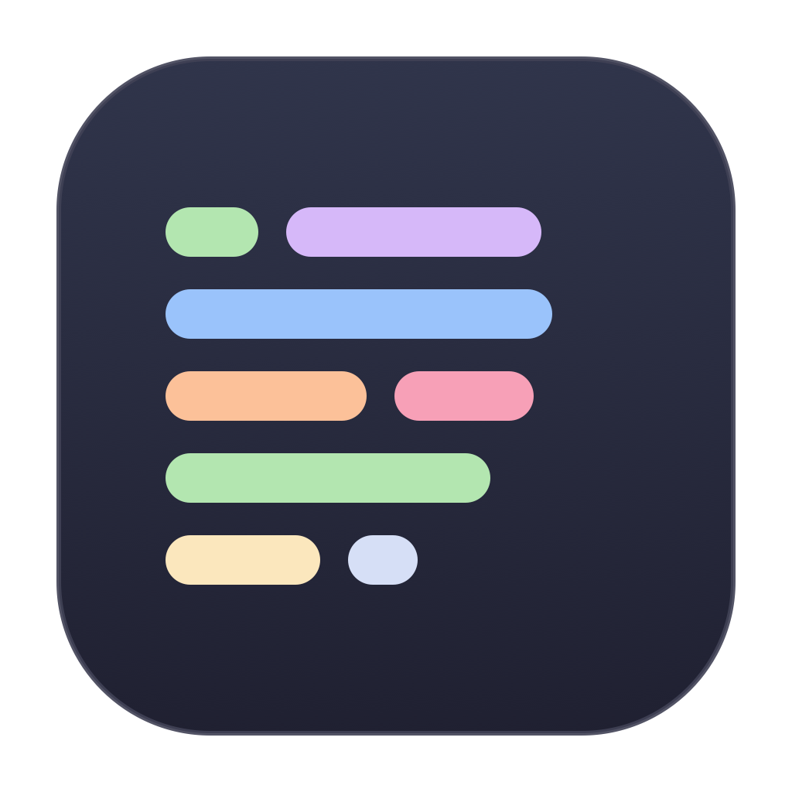
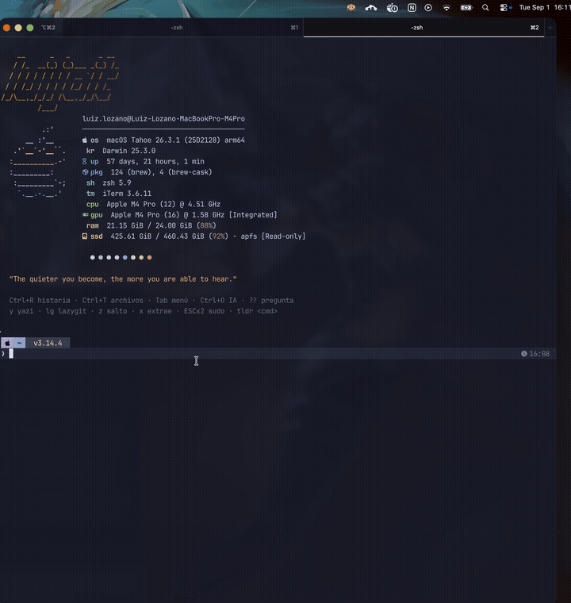

<p align="center">
  
</p>

<h1 align="center">Blurtain</h1>

**blur + curtain** — a macOS menu bar app that draws a live censorship curtain over the *text* of your sensitive windows, and nothing else.

<p align="center">
  
</p>

Streaming, screen sharing or recording your screen with terminals and Slack open is how API keys end up on YouTube. Blurtain watches your sensitive apps and covers every line of text with a blurred, color-matched bar — the window chrome, backgrounds and layout stay visible, so your screen still looks like your screen.

## Features

- **Text-level censorship** — bars hug each line of text instead of covering whole windows. Backgrounds, title bars and sidebars stay visible.
- **Color-matched bars** — every bar is tinted with the average color of the text it hides, so a syntax-highlighted terminal censors itself in its own theme colors. Bars are fully opaque by default: the text pixels are simply not present in the output.
- **Dual detection** — Apple Vision (fast OCR, line-level boxes) combined with a pixel row analysis for terminals that catches everything OCR misses: prompt glyphs, powerline segments, hashes, box-drawing characters.
- **Fail-closed** — a window that hasn't been analyzed yet (or can't be) is covered entirely. Blurtain never fails by showing text.
- **Live tracking** — bars follow windows as you move, resize and type, across all displays.
- **Zero dependencies** — two Swift files, built with `swiftc`. No Xcode project, no packages.

## Install

```sh
git clone https://github.com/luijait/blurtain.git
cd blurtain
./build.sh
open ~/Applications/Blurtain.app
```

On first activation macOS will ask for **Screen Recording** permission (Blurtain needs to see the windows to find the text in them). Grant it, then right-click the menu bar icon → **Restart Blurtain**.

> **Note on rebuilds:** the build is ad-hoc signed, so macOS invalidates the screen-recording grant every time you recompile. The app tells you when that happens (⚠︎ on the icon + a dialog) instead of failing silently. Sign with a stable identity if you rebuild often.

## Usage

Click the menu bar icon to open the menu:

| Item | Result |
|---|---|
| Enable/Disable censorship | Toggle with the current scope |
| **Scope** → Whole computer | Censor sensitive windows everywhere (default) |
| **Scope** → Display: … | Censor only the sensitive windows on that display |
| **Scope** → Window: … | Censor one specific window only |
| Restart Blurtain | Relaunch (needed after granting the permission) |

Picking a scope activates censorship on it immediately. Icon states: 🙈⏳ analyzing (windows fully covered), 🙈 text-level bars in place, ⚠︎ screen-recording permission missing.

## Configuration

`~/.config/blurtain/config.json` is created on first run and re-read every time you activate censorship — no rebuild needed.

| Key | Default | Meaning |
|---|---|---|
| `blurBundleIDs` | iTerm2, Ghostty, Terminal, Slack | Apps whose text gets censored |
| `terminalBundleIDs` | iTerm2, Ghostty, Terminal | Apps that also get the pixel row analysis |
| `colorAlpha` | `1.0` | Opacity of the color bars. **`1.0` = fully opaque (true redaction).** Lower values look like frosted glass but are not guaranteed irreversible |
| `colorFromText` | `true` | Tint bars with the censored text's average color; `false` = neutral gray |
| `padX` / `padY` | `2` / `1` | Padding around detected text, in points |
| `rowDiffThreshold` | `90` | Row analysis: RGB distance from background that counts as content |
| `detectInterval` | `0.25` | Seconds between detection passes |
| `captureScale` | `2` | Capture resolution multiplier for OCR |
| `debug` | `false` | Log to `~/Library/Logs/Blurtain.log` + annotated captures in `~/Library/Logs/Blurtain/`. **Debug captures are uncensored** — they exist to tune detection; leave this off in normal use |

## Security notes

Be honest with your threat model:

- **Nothing leaves your Mac.** Blurtain has no networking code of any kind; captures are processed in memory and discarded. The only permission it uses is Screen Recording, restricted to the apps you configure. Audit it — it's ~650 lines.
- **Default bars are opaque — the text is unrecoverable.** An opaque bar replaces every text pixel with a flat color; there is nothing to deblur. The only signal that survives is each bar's tint (the line's *average* color, e.g. "this line was mostly green") — set `"colorFromText": false` if even that bothers you. Lowering `colorAlpha` switches to a frosted-glass look, which is pretty but merely *attenuates* information: recovery attacks on blurred/pixelated text exist, so don't use it for captures containing real secrets.
- **Share your full screen, never an individual window.** Window-level sharing in Zoom/Meet/OBS captures the app's own surface and bypasses any overlay. Full-screen/display sharing captures the composited result, curtain included.
- **New text has a small exposure window** (~half a second) until the next detection pass covers it. Newly opened windows are born fully covered.

## How it works

1. `CGWindowList` tracks sensitive windows cheaply (~7 Hz) to keep bars glued to them.
2. On each detection pass, ScreenCaptureKit captures each window off-screen; the image is cropped to its real content bounds (the capture API letterboxes on some display scales).
3. Vision's fast text recognizer produces line-level boxes; for terminals, a histogram finds the dominant background color and any pixel row that differs from it becomes a band, with per-band horizontal extents.
4. Each bar samples the average color of the non-background pixels it covers.
5. A borderless, click-through overlay window per display renders an `NSVisualEffectView` masked to the bars plus a tinted `CALayer` per bar.

MIT © [luijait](https://github.com/luijait)
